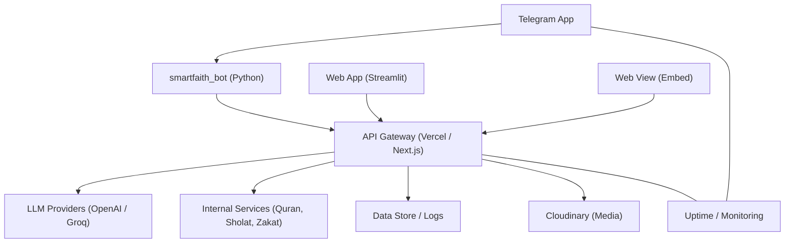
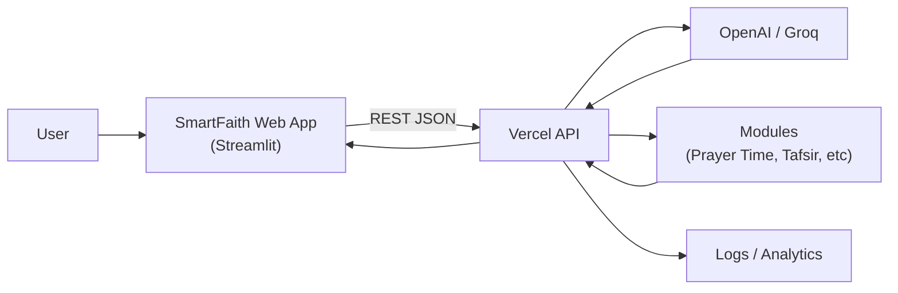
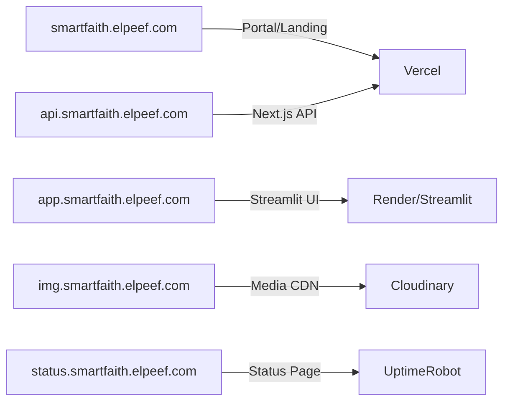

# 🏗️ SmartFaith Architecture

Dokumen ini menjelaskan arsitektur ekosistem **SmartFaith**, meliputi Telegram Bot, Web App, Web View, dan API Gateway.  
Tujuannya agar contributor dan tim dev mudah memahami alur sistem, integrasi, serta kebutuhan deployment.

---

## 🔎 High-level Overview



---

## 💬 Alur Pesan (Telegram → Jawaban AI)

```mermaid
sequenceDiagram
  participant U as User (Telegram)
  participant T as Telegram Servers
  participant B as smartfaith_bot (Python)
  participant G as API Gateway (Vercel)
  participant M as LLM Provider (OpenAI/Groq)

  U->>T: Kirim pertanyaan
  T->>B: Webhook update
  B->>G: POST /api/chat (payload: text, user_id)
  G->>M: Prompt → completion/stream
  M-->>G: Respon
  G-->>B: Jawaban siap kirim
  B-->>T: Send message
  T-->>U: User menerima jawaban
```



---

## 🌐 Web App Flow



## 🌍 Subdomain Mapping



---

## 📂 Komponen & Repo

- smartfaith-bot → Telegram bot (Python + keep-alive).

- smartfaith-web → Streamlit app (UI).

- smartfaith-api → Next.js API (Vercel).

- smartfaith-assets → CDN/Cloudinary (gambar, ikon, file).

---

## 🔑 Environment Variables

Telegram Bot
```ini
TELEGRAM_TOKEN=...
OPENAI_API_KEY=...
API_BASE_URL=https://api.smartfaith.elpeef.com
```

Next.js API
```ini
MODEL_PROVIDER=openai|groq
MODEL_NAME=gpt-4o-mini|llama-3.1-8b-instant
OPENAI_API_KEY=...
GROQ_API_KEY=...
NEXTAUTH_URL=https://api.smartfaith.elpeef.com
NEXTAUTH_SECRET=...
ALLOWED_ORIGINS=https://smartfaith.elpeef.com,https://app.smartfaith.elpeef.com
```

Streamlit
```ini
API_BASE_URL=https://api.smartfaith.elpeef.com
CLOUDINARY_CLOUD_NAME=...
CLOUDINARY_API_KEY=...
CLOUDINARY_API_SECRET=...
CLOUDINARY_FOLDER=smartfaith/gallery
```

---

## 🔒 Security

- Gunakan .elpeef.com sebagai cookie domain (untuk SSO lintas subdomain).

- CORS whitelist → hanya domain resmi.

- Rate limiting di endpoint chat.

- Rotate API keys secara berkala.

---

## 📊 Monitoring

- Uptime: UptimeRobot/BetterUptime untuk API & Web App.

- Logs: simpan minimal error logs + audit percakapan.

- Alerts: error rate/latency tinggi → notifikasi Telegram admin.

---

## 🛠️ Roadmap

- Integrasi SSO Telegram ↔ Web App.

- Session memory per user (riwayat percakapan).

- Database logging permanen.

- Multi-bahasa.

- Migrasi Streamlit → Render/Custom hosting (anti-sleep).

---

`📌 Catatan: Dokumen ini pelengkap README, fokus di arsitektur & operasional. Update sesuai perkembangan ekosistem SmartFaith.`
